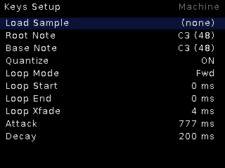
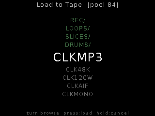

# Common concepts

Conventions every machine shares. Panel context: **8 CV inputs** (ch1/2 are
1V/oct-scaled jacks, ch3/4 bipolar, ch5–8 knob+jack combos), **TR1/TR2** gate
inputs (active low), one **encoder** (turn / press / long-press), stereo
**line in/out** (no mic, no CV/gate output — the output is audio only).

## Encoder grammar

- **Turn** — move / adjust. **Press** — select / toggle / small option sets
  cycle in place. **Long press** — switch page (usually Live ↔ Setup).
- **Setup pages** share one framework: option rows cycle on press, numeric
  rows open a `[ bracketed ]` edit (turn changes, press closes), `>` rows are
  actions or sub-pages. The top-right **Machine** affordance jumps to the
  machine selector.

## Clock and grid

All clock consumers share one conditioned input stack: pick a **Clock Src**
(CV1–8 or `AUDIO` = the beat listener following the audio input), and the
detector locks to pulses with guards against ghost edges and octave errors.
Machines display the locked BPM and derive grids, quantized loops, and synced
transports from it. Deck/Tracker also take a clock multiple (pulses per beat).

## Sample pool

One pool on SD (`usr/` + `REC`/`LOOPS`/`SLICES`/`DRUMS` folders) speaks
`.RAW`, `.WAV`, `.AIFF` natively; MP3 and other rates/depths are converted
once on import (upload or `POST /import`). Ids are extension-less and ≤ 8
chars (FatFS 8.3). Recordings are `REC_NNNN`, bounces `BNC_NNNN`, tape crops
`TAP_NNNN`, looper saves in `LOOPS/`.

The **browser** (encoder press in most machines) lists newest-first with
folders on top; turn to browse, press to load, long-press to cancel.

## Knob takeover

Machines that map knobs 5–8 to parameters use **takeover**: the knob is
inert until you move it (~3% travel), so a stale knob position never yanks a
setting on machine switch or patch load. UI dials light up when a knob is live.

## Web interface

Every machine is reachable at `http://<ip>/` — Files (pool manager), Upload
(converts anything in-browser), Remote (live meters + CV fader strip, soft
trigs, encoder, machine switch + settings editor, TFT **screen mirror**,
bounce, broadcast), plus tabs some machines add (Radio, Editor, Freesound).

## Broadcast & bounce (any machine)

- **Bounce** — record the machine's *output* to a new `BNC_` pool take
  (web Remote tab or `POST /bounce/start|stop`).
- **Broadcast** — live streams on port 8000: `/` stereo WAV, `/live.mp3`
  96k mono MP3 (icecast-style), `/in` + `/in.mp3` the same taps on the
  **line input** (streaming bridge). One listener at a time.
- **Icecast push** — the module can act as a *source client*, pushing the
  output as MP3 to an icecast mountpoint (web BROADCAST card → PUSH).
  Note: MP3 encoding is not realtime while Radio is playing.
