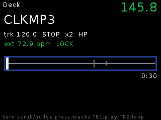
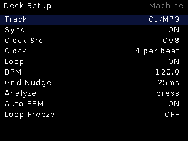

# Deck

**Tempo-syncing track player.** Streams long tracks from SD and phase-locks
their playback speed to your external clock — a turntable that always plays
in time with the rack.

## Features

- **Varispeed playback phase-locked** to the clock (pulse-level PLL;
  clock multiples 1/4..4 pulses per beat). Measured lock: ~90 % of beats
  within ±7 ms.
- **Offline BPM + beat-grid analysis** (±0.0005 BPM on reference material),
  cached in the track's sidecar; runs automatically on unanalyzed tracks and
  coexists with playback.
- **Loop** — streamed beat-ladder loops (1/4 to 256 beats), window moves
  scheduled seamlessly, no PLL reset on wrap; Loop Freeze holds the window.
- Grid Nudge for fine phase alignment; per-track BPM stamps.
- Transport bar: grey waveform, white playhead, loop window boxed.

## Controls

| Control | Function |
|---|---|
| TR1 | Tap = play/pause, hold = restart at downbeat |
| TR2 | Loop toggle |
| Encoder turn | Scrub / nudge |
| Encoder press | Track browser (newest first) |
| Encoder long | Live ↔ Setup |

## Setup

Track, Sync, Clock Src, Clock (pulses per beat), Loop, BPM, Grid Nudge,
Analyze, Auto BPM, Loop Freeze.

## Tips

- Deck audio is legitimately rough for ~60 s after boot and ~15 s after
  scrubs (ring refill + PLL relock) — judge sync only after it settles.
- Fresh uploads have no BPM stamp yet: load once and let auto-analysis run.
