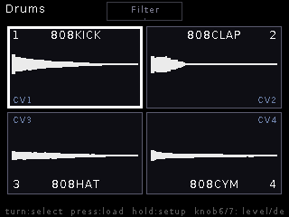
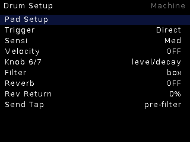

# Drums

**Four-pad one-shot drum sampler** — but each pad can carry a second **choke
layer**, so it's 4 cells, up to 8 sounds, 8 triggers. The classic use: open
and closed hi-hat on one pad, each cutting the other off.

## Features

- 4 mono RAM pads; per-pad **A/B choke layers** sharing one voice (either
  hit interrupts the other).
- Trigger modes: **Direct** (per-CV Schmitt triggers) or **CV-select**
  (TR1/TR2 fire, a selector CV picks the pad; with layers TR1 = A, TR2 = B).
- **Performance knobs** (6/7), neutral at noon, takeover-armed, driving
  whatever the encoder points at:
  - Knob 6 = level (noon unity, clockwise drives up to 4× through a cubic
    soft clipper)
  - Knob 7 = counterclockwise decay choke; clockwise one of four per-pad
    targets (retrig loop / attack / start / none), retrig with repeat caps
- **Master filter** — a box in the middle of the pad grid the encoder selects
  like a pad: knob 6 = DJ-style sweep (LP↔HP through noon), knob 7 = resonance.
- **Reverb** hosted post-filter with per-pad sends and a pre/post Send Tap.
- Lazy buffers — an empty kit costs no RAM; failed loads fail soft.

## Controls

| Control | Function |
|---|---|
| CV1–8 | Pad triggers (Direct mode) |
| TR1/TR2 | Pad fire (CV-select mode / layer A/B) |
| Encoder | Trace the pad grid circularly (half-cells for layered pads) |
| Knob 6/7 | Performance (level+drive / decay+retrig), or filter sweep+res on the filter box |
| Encoder long | Live ↔ Setup |

## Setup

Pad Setup (per-pad sample/layer/tuning), Trigger mode, Sensitivity, Velocity,
Knob 6/7 mode, Filter, Reverb + Rev Return + Send Tap.
