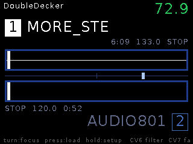
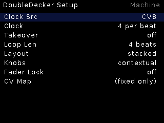

# DoubleDecker

**Two synced Decks and a crossfader.** Both decks phase-lock to the same
clock; the crossfader (knob/CV) blends them with equal power, each deck gets
its own DJ filter — a two-turntable rig in 18HP.

## Features

- Two independent streamed decks, each with the Deck's PLL sync engine.
- **Auto-BPM**: loading an unstamped track analyzes it in the background
  (stopped deck only) so both decks can loop.
- **Per-deck DJ filters** (LP↔HP sweep).
- **Loops** per deck (KO-II style ladder), quantized starts, momentary loop.
- **Both-trig resync gesture**; single-list browser across the pool.
- Layouts: stacked or side-by-side; contextual knobs follow the focused deck.

## Controls

| Control | Function |
|---|---|
| TR1 | Focused deck: tap = quantized start/restart, hold = stop |
| TR2 | Focused deck: press = loop toggle, hold = momentary loop |
| Crossfader (CV7) | Equal-power blend deck A ↔ deck B |
| Encoder press | Load track into the focused deck |
| Encoder long | Live ↔ Setup |

## Setup

Clock Src, Clock (pulses per beat), Takeover, Loop Len, Layout, Knobs,
Fader Lock, CV Map.
