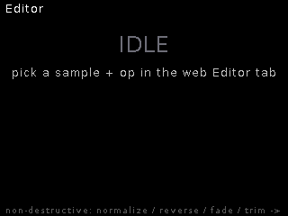

# Editor

**Silent web-driven file editor.** Non-destructive offline operations on pool
samples — each op streams the source through a transform and writes a *new*
take, so originals are never touched. (For interactive, visual editing see
[Tape](tape.md) — the Editor is the batch tool.)

## Features

- Ops: **normalize** (two-pass peak), **reverse**, **fade in/out**,
  **trim silence** (two-pass).
- Runs as a background job; the web Editor tab shows progress.
- Outputs are short generated ids (8.3-safe), landing back in the pool.

## Controls

Web Editor tab, or REST while active:
`/edit/apply?name=<id>&op=<normalize|reverse|fadein|fadeout|trim>[&param=…]`,
`/edit/state`. The on-device screen is status-only.
