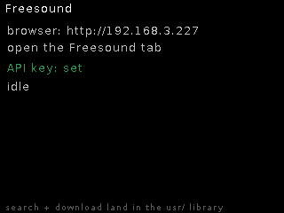

# Freesound

**Silent web-driven utility** — search freesound.org, preview results and
pull sounds straight into the pool, from the browser while the module sits in
the rack.

## Features

- Web tab: search, list results, **Get** downloads a preview and decodes it
  to `usr/` (mono → stereo expand, sidecar written).
- **Direct-URL fetch** — paste any MP3 URL, it lands in the pool.
- Non-44.1 kHz MP3s are rejected here (convert-on-import handles those via
  the Upload tab instead).

## Controls

Entirely web-driven (`/fs/search`, `/fs/get`, `/fs/fetch`, `/fs/state` while
the machine is active). The on-device screen shows status only.

## Notes

Full OAuth (original-quality downloads) is scaffolded but not yet enabled;
previews are the current path.
