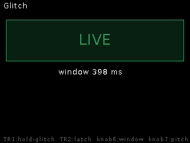
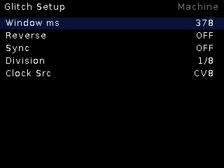

# Glitch

**Live-input stutter / beat-repeat.** No SD, no samples — it grabs the line
input into a rolling window and repeats it, clock-synced when a clock is
patched.

## Features

- Rolling capture window (**Window ms**) over the live input.
- **Sync** to the shared clock with a **Division** ladder (1/8 etc.) so
  repeats land musically; free-running window when unsynced.
- **Reverse** repeats.
- Zero storage: everything is RAM, instant.

## Controls

| Control | Function |
|---|---|
| TR1 | Stutter gate (hold to repeat) |
| Encoder | Window / parameters |
| Encoder long | Live ↔ Setup |

## Setup

Window ms, Reverse, Sync, Division, Clock Src.
