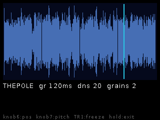
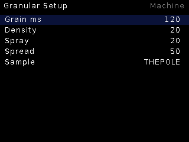

# Granular

**16-grain cloud** over a mono pool sample. Raised-cosine grains scattered
around a position cursor — from clean time-stretch textures to smeared clouds.

## Features

- 16 simultaneous grains, raised-cosine windowed (clickless).
- **Grain ms** (size), **Density** (spawn rate), **Spray** (position
  randomization) and **Spread** (stereo scatter).
- Any pool sample via the shared browser.

## Controls

| Control | Function |
|---|---|
| Encoder | Position cursor / parameter adjust |
| Encoder long | Live ↔ Setup |
| CV | Position and parameter modulation |

## Setup

Grain ms, Density, Spray, Spread, Sample browser.
