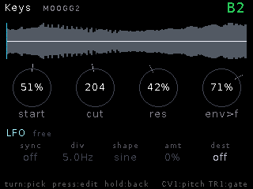

# Keys

**Tonal instrument sampler** — load one sample, tell it the root note, and
play it pitched over ±2 octaves from 1V/oct with a **sustain loop** so held
notes ring for as long as the gate does. The Synth's envelope/filter/reverb
architecture wrapped around a sample.

## Features

- Resident mono sample (cubic-interpolated varispeed — clean high end).
- **Forward sustain loop**: Loop Start/End with zero-crossing snap and a
  wrap **crossfade** — dial in a click-free sustain region and hold notes
  indefinitely; releases play through naturally.
- Synth-style **ADSR** + envelope-opened SVF low-pass; glide; quantize.
- **LFO** to cutoff or pitch (the Synth's, shared): rate/depth, five shapes
  (sine/tri/saw/sqr/rnd) and optional **tempo sync** to the core clock in
  divisions from 4 bars to 1/16.
- **Four macro knobs** with takeover: K5 start offset, K6 cutoff, K7
  resonance, K8 env→cutoff — mirrored as live dials on the dashboard.
- **CV matrix** with sampler-native destinations: cutoff, res, env>cut,
  level, pitch, **start**, **loop move**, **loop length**.
- **Reverb**; **named patches** (`Save/Load Patch`, newest-first browser).
- Live dashboard: waveform strip with the loop window boxed and a playhead,
  note name readout, macro dials, and a bottom strip that switches between
  the ADSR curve and the LFO cells (press the ENV/LFO header).

## Controls

| Control | Function |
|---|---|
| CV1 | 1V/oct pitch |
| TR1 | Gate (retriggers from the start offset) |
| Knobs 5–8 | start / cutoff / res / env>cut (takeover) |
| Encoder long | Live ↔ Setup |

## Setup

Load Sample, Root Note, Base Note, Quantize, Loop Mode/Start/End/Xfade,
ADSR, Env>Cut, Glide, LFO Rate/Depth/Dest/Sync/Div/Shape, Level,
Reverb + Mix, CV Matrix,
Save Patch / Load Patch.
