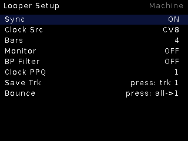

# Looper

**4-track clock-synced RAM looper.** Record layered loops against a shared
clock, save any track to the pool, shape each track with a band-pass filter.

*Live-page screenshot pending — run `tools/capture_docs.sh`.*

## Features

- Four independent tracks in RAM, loop length in **bars** against the clock
  (Sync ON) or free-running.
- **Save Trk** writes the selected track to `usr/LOOPS/` as WAV.
- **Bounce** mixes all tracks down to track 1.
- Per-track **BP filter**, level and pan (CV6/CV7 drive the selected track's
  level/pan — the two full-range knobs on this unit).
- Clock: any CV source or the beat listener; PPQ setting for clock multiples.
- Monitor toggle for hearing the input while overdubbing.

## Controls

| Control | Function |
|---|---|
| TR1 | Clock input by default (maskable) |
| Encoder turn | Select track / adjust |
| Encoder press | Record / play toggle on the selected track |
| Encoder long | Live ↔ Setup |
| CV6 / CV7 | Selected track level / pan |

## Live page

Waveform-thumbnail lanes, one per track, with a state-colored playhead
(record = red, play = white) and the selected lane's number on a white plate.

## Setup

Sync, Clock Src, Bars, Monitor, BP Filter, Clock PPQ, Save Trk, Bounce.
