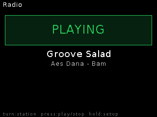

# Radio

**Internet radio in the rack.** Streams icecast/shoutcast MP3 stations
(http and https) through the module — and because bounce and broadcast are
core services, you can *sample the radio* or re-stream it.

## Features

- Helix MP3 decode of endless streams into a 4 s ring; pre-buffers ~0.5 s,
  auto-reconnects on drops, shows ICY **now-playing** metadata.
- **Any sample rate 8–48 kHz** — non-44.1k stations (48k is common) are
  cubic-resampled live to the module's rate.
- **Station favourites**: SomaFM presets built in; save/delete your own
  (persisted on SD) from the web Radio tab.
- Play by URL — point it at any stream endpoint.

## Controls

| Control | Function |
|---|---|
| On-device Live | Pick a preset station |
| Web Radio tab | Play/stop, station list + save, URL play, buffer meter |
| REST | `/radio/play?station=N` or `?url=…`, `/radio/stop`, `/radio/state` |

## Tips

- **Sample the radio**: Remote tab → BOUNCE while playing → a `BNC_` take
  lands in the pool.
- Radio + the MP3 broadcast encoder don't fit the CPU together — while Radio
  plays, use the WAV broadcast or bounce instead, and stop Radio before OTA
  updates (it starves internal RAM).
