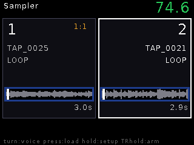
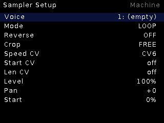

# Sampler

Two-voice **clock-time loop recorder**. Each voice records a take against the
clock, then loops a crop window of it — start/length performable at CV rate
without glitches. The synced-record workflow runs from an external clock or
the built-in internal clock.

## Features

- Per-voice **recorded takes** (line in), auto-pickup of finished recordings,
  explicit Record page with ARM/REC banner.
- **Crop windows** (start + length) with four modes: `OFF`, `FREE`,
  `QUANT`, `QUANTx2` — quantized modes snap crop points to whole beats of the
  take's BPM stamp.
- **Streamed playback**: 1 s RAM head for instant gate retrig + SD streaming
  for the tail; loop wraps are seamless cursor math with a ~6 ms crossfade.
- **CV matrix**: per-voice Speed / Start / Length, each assignable to any of
  CV1–8 (median-filtered).
- **Joint grid snap**: hold BOTH gates ~1 s → both loops restart from their
  window starts on the same clock pulse.
- Internal clock (40–240 BPM) drives the whole synced workflow standalone.

## Controls

| Control | Function |
|---|---|
| TR1 / TR2 | Gate voice 1 / voice 2 (latch behavior per voice mode) |
| Encoder press | Track browser (newest first) |
| Encoder long | Live ↔ Setup |
| CV matrix | Speed / Start / Length per voice, any CV source |

## Setup highlights

Voice select, play Mode, Reverse, Crop mode, Speed/Start/Len CV sources,
Level, Pan, Start — plus the Record page (arm, internal clock BPM).

The Live page shows mirrored side-by-side voice panels: black canvas, bold
waveform, and a state-colored box whose ends sit AT the crop points — the box
IS the loop window.
