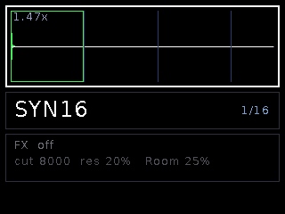
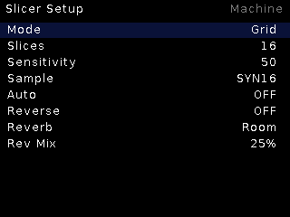

# Slicer

**Any-length sample slicer.** Chop a pool sample into slices by grid,
transient detection, or an imported Octatrack `.ot` file, and fire them from
triggers/CV. No length ceiling: slice attacks live in RAM, tails stream from
SD while a slice plays.

## Features

- **Three slicing modes**: `Grid` (equal divisions), transient detection with
  a **Sensitivity** dial, or `.ot` import (writes back too).
- **Streaming architecture**: per-slice 80 ms attack heads in RAM
  (reverse pre-flipped), the playing slice's tail streamed into a 2 s ring —
  works on an 8-minute file as easily as an 8-second one.
- Reverse playback, per-slice addressing from CV, rapid retrigger safe
  (bench-tested: 20 rapid advances, zero starves).
- **Reverb** send (Room/Hall/Plate/Shimmer) with mix control.
- Async loads with progress — a long file scans peaks + envelope in the
  background (~1.5 min per 8 min of audio).

## Controls

| Control | Function |
|---|---|
| TR1 | Fire / advance slice |
| CV | Slice select (addressable), performance mods |
| Encoder | Slice cursor / browse; boxed 2-level menu (border thickness = level) |
| Encoder long | Live ↔ Setup |

## Setup

Mode (Grid/Transient/OT), Slices count, Sensitivity, Sample browser, Auto,
Reverse, Reverb + Rev Mix.
