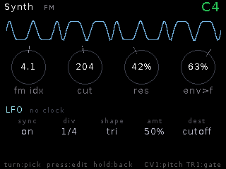
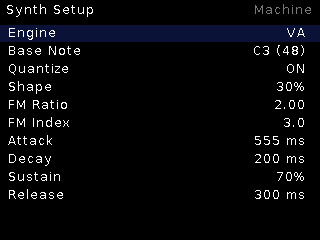

# Synth

**No-sample sound source** — a complete mono voice: three engines
(virtual-analog, 2-op FM, wavetable), ADSR, envelope-driven filter, glide,
LFO and reverb. Patch a keyboard/sequencer's 1V/oct + gate and play it.

## Features

- **Engines**: `VA` polyBLEP saw↔square with shape morph; `FM` 2-op with
  ratio + index; `WT` wavetable — load any single-cycle (or longer) pool
  sample as the table via Load Wave.
- **Pitch**: CV1 at 1V/oct (calibrated to this unit), quantize-to-semitone
  toggle, Base Note, **glide**.
- Linear **ADSR** → VCA; SVF low-pass with resonance, envelope amount to
  cutoff (`Env>Cut`).
- **LFO** to cutoff or pitch, rate/depth.
- **Reverb** (Room/Hall/Plate/Shimmer) with mix.
- **CV matrix**: 8 destinations (cutoff, res, env>cut, level, pitch, shape…)
  each assignable to any CV source with signed amounts.
- **Named patches**: Save Patch mints `PAT_NNN`; Load Patch opens a
  newest-first browser. Live dashboard with waveform, macro dials and ADSR.

## Controls

| Control | Function |
|---|---|
| CV1 | 1V/oct pitch |
| TR1 | Gate (ADSR) |
| Knob 6 / 7 | Cutoff / resonance |
| Encoder long | Live ↔ Setup |

## Setup

Engine, Base Note, Quantize, Shape, FM Ratio/Index, ADSR, Env>Cut, Glide,
LFO Rate/Depth/Dest, Level, Reverb + Mix, Load Wave, CV Matrix,
Save Patch / Load Patch.
