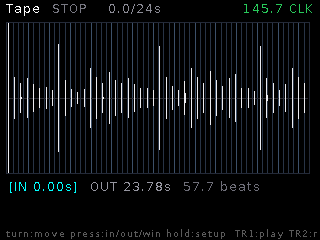
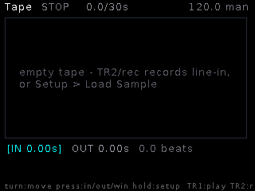

# Tape

**Single-track tape recorder/editor.** One mono tape (up to 60 s) you record
line-in onto — or load any pool sample — then *see*: the whole screen is one
big waveform with a crop window, a beat grid, and a playhead. Edit with the
encoder, print effects to tape, splice with cut/copy/paste, and bounce crops
back to the pool.

## Features

- **The screen is the editor**: full-tape waveform, crop window boxed bright
  (material outside dimmed), beat-grid ticks **anchored at the IN point**
  (every 4th beat brighter), white playhead / red record head.
- **Grid** from the shared clock (CV1–8 or the beat listener) or a manual
  BPM; cursor moves snap to beats — or to zero-crossings when gridless.
  **Crop Beats** ladder (1–32) sets the window to an exact musical length.
- **FX chain in the signal path**: SVF filter (LP/BP/HP) → drive (cubic
  soft-clip) → reverb. Incoming audio monitors through it, and the record
  head taps **post-FX** — you print what you hear. `Rec Source: tape`
  re-prints the tape itself through the chain (that's also how reverb gets
  printed — live recording keeps the tail output-only).
- **Editing** (transport stopped): **cut / copy / paste** via a clipboard,
  normalize, reverse, fade edges — and **Save Crop** writes a `TAP_NNNN`
  pool take in the background.
- **Recorder**: TR2 punches in/out anywhere, tape-style overwrite; first
  recording fills the reel from the top. Playback loops the crop window.
- **Performance CV** (knobs 5–8, takeover): window move / cutoff / res /
  drive — slide the loop window across the tape from a knob or CV.

## Controls

| Control | Function |
|---|---|
| TR1 | Play / stop (transport) |
| TR2 | Record punch in/out |
| Encoder turn | Move selected cursor (grid-snapped) |
| Encoder press | Cycle cursor: IN → OUT → WIN (slide the whole window) |
| Encoder long | Setup |
| Knobs 5–8 | Window move / cutoff / resonance / drive |

## Setup

Crop Beats, Clock Src, Manual BPM, Filter + Cutoff + Reso, Drive, Reverb +
Mix, Level, Rec Source (input / tape re-print), Monitor, Copy, Cut, Paste,
Normalize, Reverse, Fade Edges, Save Crop, Load Sample, Clear Tape,
Tape Len (15/30/60 s — trims honestly if RAM is tight).
