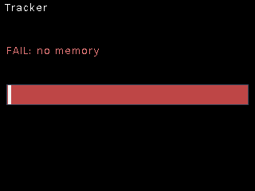
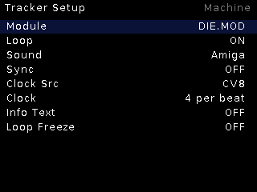

# Tracker

**Module player** (MOD/XM/S3M/IT via libxmp) with live performance controls —
play classic tracker modules and treat their patterns as loopable, scrubbable
material synced to your rack.

## Features

- Full libxmp playback of pool `.MOD`-family files.
- **Sequence loop** (KO-II grammar) — loop any pattern window live; loop
  jumps move the *cursor*, not the voices, so notes **ring across the seam**
  (a deliberate feature no sample player can imitate).
- **Bar scrub** with grid snap; dim-outside-loop bar display.
- **External sync**: live-BPM ratio + tick-phase servo against the shared
  clock (24 ticks/beat), or free-running at the module's own tempo.
- Amiga-style output color option; Loop Freeze; info text overlay.

## Controls

| Control | Function |
|---|---|
| TR1 | Tap = play/pause, hold = restart |
| TR2 | Loop toggle |
| Encoder turn | Scrub bars / move loop |
| Encoder press | Module browser |
| Encoder long | Live ↔ Setup |

## Setup

Module, Loop, Sound (Amiga), Sync, Clock Src, Clock (pulses per beat),
Info Text, Loop Freeze.
